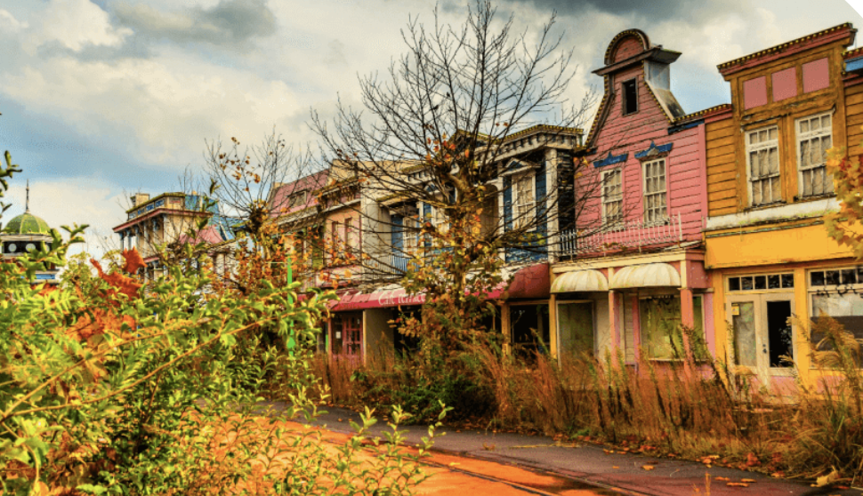

## Here is a photo of Nara Dreamland, an abandoned Japanese themepark said to have inspired the theme park that appears in Spirited Away:

### [Return to Welcome](https://github.com/mollyjones2023/ghibli-simulacrum/blob/main/1-welcome-to-the-park/welcome.md)
