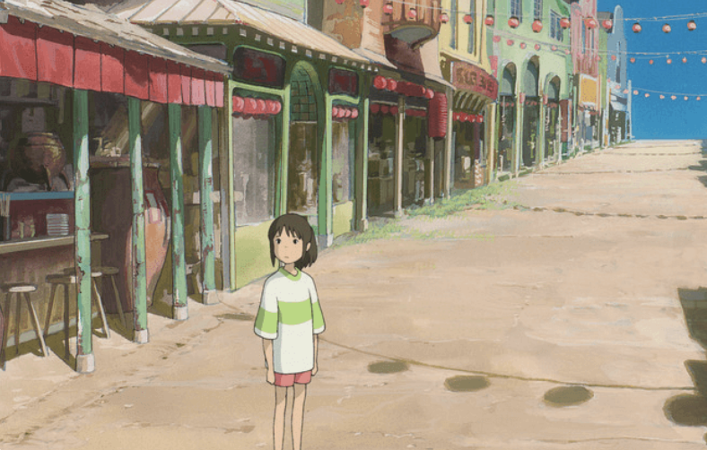
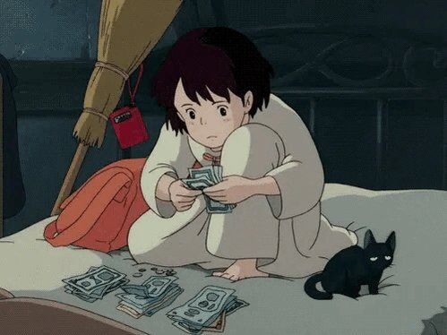
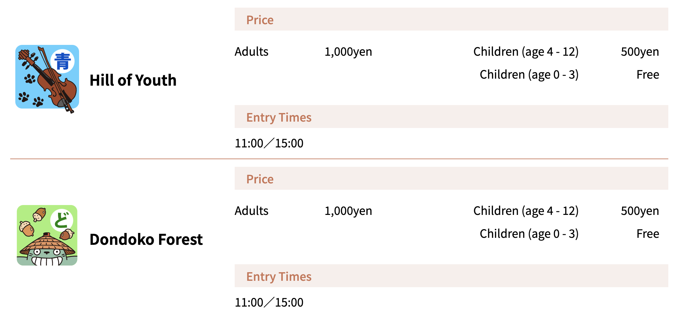
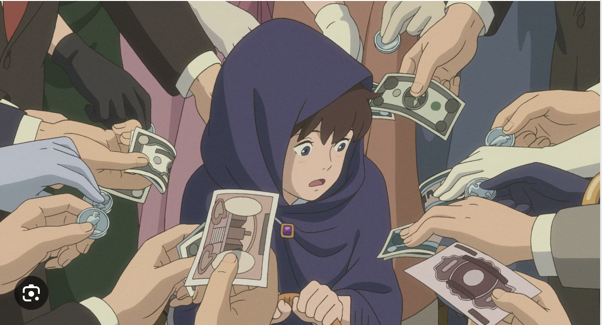

# Welcome to the park!

#### Throughout your visit, you will have the chance to explore the layers of the park's simulacrum. 

## For example, here is a theme park, like the Ghibli Park, that was featured in the Studio Ghibli film Spirited Away:

### [Click here]() to see the inspiration for this scene's setting 

## Entering the park...
### You have just entered the Ghibli Park Simulacrum throught the West Entrance. Amusement awaits within! However, first you must buy your ticket.
 

## Ticket prices

## You must pay to get into each of the areas!

## Thank you for your purchase!
Now that you bought your tickets, you get to explore the world of Studio Ghibli in real life!

### [Return home](https://github.com/mollyjones2023/ghibli-simulacrum/tree/main#readme) to continue your adventure!
