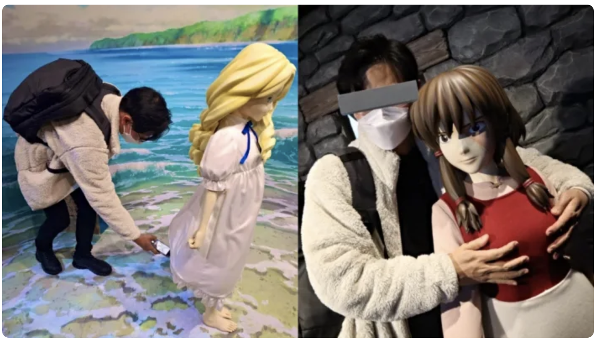

# Welcome to the Warehouse Exhibitions!

## Interact with physical renditions of Studio Ghibli Scenes:

## Sit with No Face on the train

### [Click here](https://github.com/mollyjones2023/ghibli-simulacrum/blob/main/2-ghibli-grand-warehouse/1-exhibitions/spirited-away-train.md) to see the scene from Spirited Away

## Explore Ghibli food in a recreation of an animated kitchen

### [Click here]() to see the kitchen from Up on Poppy Hill and food from My Neighbor Totoro

## See how some guests have decided to engage with the characters in these scenes!

 
 
### [Return to Information Center](https://github.com/mollyjones2023/ghibli-simulacrum/blob/main/2-ghibli-grand-warehouse/warehouse.md)

