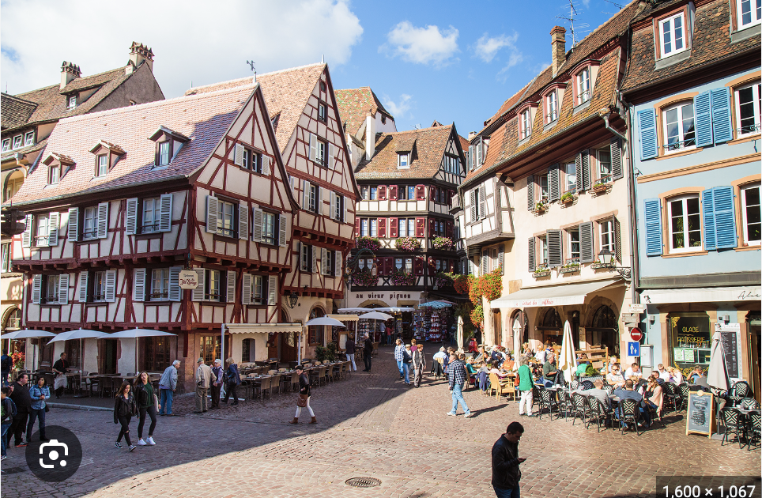

## A square in Colmar, France, said to have inspired the architecture in Howl's moving castle

### [Back](https://github.com/mollyjones2023/ghibli-simulacrum/blob/main/3-hill-of-youth/1-elevator-tower/howls-town.md)
### [Return to Elevator Tower](https://github.com/mollyjones2023/ghibli-simulacrum/blob/main/3-hill-of-youth/1-elevator-tower/tower.md)
