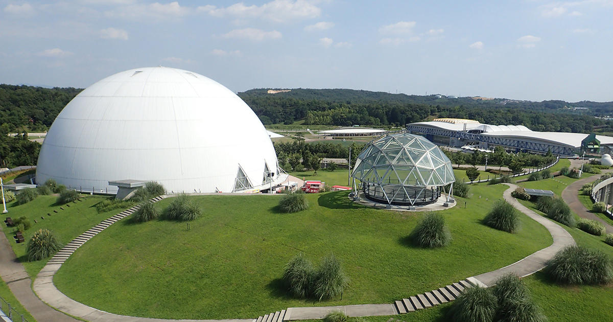

# The Land 
"With close consultation with the surrounding forest, it is being built on and within the grounds of Expo 2005 Aichi Commemorative Park (Moricoro Park).
There are no big attractions or rides in Ghibli Park.
Take a stroll, feel the wind, and discover the wonders."

### [Return home](https://github.com/mollyjones2023/ghibli-simulacrum/tree/main#readme)
